# Marine Debris Sonar AI — System Architecture (v1.0)

Project: **AI-Powered Automated Underwater Marine Debris & Anomaly Detection** (Smart India Hackathon).
Scope of this document: production-quality, implementation-ready architecture. **No implementation code.**

Status of decisions: Decisions marked **[OPEN]** are tracked in Appendix A (`Appendix-Open-Decisions.md`) and are configurable in the design so they can be finalized without re-architecture.

---

## SECTION 1 — Architecture Summary

In plain language:

- The **brain of the product is a Python ML pipeline**. It ingests sonar imagery/log data, cleans and normalizes it, runs an object detector, filters out likely false positives, attaches coordinates when navigation metadata genuinely exists, and emits structured results.
- **FastAPI is a thin bridge**, not the brain. It validates uploads, invokes the pipeline, stores results, and serves JSON/CSV/PDF artifacts. It contains no ML logic of its own.
- **React is a control panel and visualization layer**. It uploads data, previews preprocessing, displays detections over the sonar image, plots detections on a Leaflet map when coordinates exist, browses history, shows model metrics, and triggers exports. It contains **zero** ML or business logic.
- A **modular monolith** is the target: one deployable backend + one SPA frontend. Internal Python package boundaries (`mlpipeline`) keep preprocessing / detection / filtering / geolocation / reporting separately testable and replaceable.
- **Everything configurable lives in versioned YAML configs**: class names, confidence/IoU thresholds, preprocessing chains, dataset definitions. The exact detector (YOLO-family first) sits behind a `Detector` interface so it can be swapped without touching API or frontend.
- **Persistence is local-file-first** (a `data/` artifact store + JSON manifests), with a repository abstraction so MongoDB can be enabled later by config alone. MongoDB is **[OPEN]** for the MVP.
- **Model confidence ≠ system verdict.** The detector's raw score is preserved untouched; a separate rule-based filtering/scoring layer produces the *final system confidence* and a `filtering_status` (accepted / flagged / rejected + reasons). Both travel through to the UI.
- **No fabricated coordinates, ever.** If navigation metadata is missing or unparseable, lat/lon are `null` and the UI explicitly shows "location unavailable".
- **CPU-first, GPU-optional.** Inference runs on CPU for the MVP demo; device selection and model export (ONNX optional) let the same code use a GPU when present.
- Reproducibility is first-class: every result records the model version, preprocessing config hash, thresholds, and source-file traceability.

The primary product is a **working sonar AI pipeline**; the dashboard exists to prove it, not the other way around.

---

## SECTION 2 — Architecture Decision

Why this architecture beats the realistic alternatives:

| Alternative considered | Why rejected (for SIH context) |
|---|---|
| **Microservices** (separate preprocessing / inference / API services, queue bus) | Team is students on a hackathon deadline; ML and API share release cadence; network + container orchestration overhead buys nothing. Rejected. Internal module boundaries inside one FastAPI process preserve the option to extract services later. |
| **Everything in Jupyter notebooks** | Not reproducible, not demoable, no API. Notebooks are kept only as *exploration* surfaces (`ml/notebooks/`), never as the pipeline. |
| **Server-rendered app (Django/Flask templates)** | The dashboard (map, overlay drawing, polling) genuinely needs client-side interactivity; React+TS with a typed API client is cleaner and demonstrable. But the server stays a thin API, so this is React-on-a-thin-FastAPI, not an SPA-heavy product. |
| **Frontend-centric prototype with mock AI** | Violates the core goal; SIH judges want to see real detection on real sonar data. UI effort is capped at ~5% of time by design (Section 21). |
| **Train in the web app** | Training is a CLI/CI activity with its own lifecycle (hours, GPU, datasets), not a request/response operation. The API exposes *model metadata and metrics*, and never trains. This keeps the backend deterministic and demo-safe. |
| **MongoDB from day one** | File-based JSON manifests + artifact store are sufficient and debuggable for the MVP. A repository interface (`DetectionRepository`) makes Mongo an additive change. Avoids infrastructure risk at demo time. |
| **Hard-coupled YOLO (e.g., `ultralytics` types in API responses)** | Would make any detector swap a full-stack rewrite. The canonical `Detection` dataclass and a `Detector` interface isolate the model. |

Key positive decisions embedded in the design:

1. **Train/serve skew elimination:** the *same* preprocessing config artifact (YAML + content hash) is stored with the model version and reloaded at inference. Preprocessing is never "re-created by hand" at serving time.
2. **Dataset-first risk posture:** the largest unknown is data. The architecture ships with a dataset inspection/conversion layer and dataset manifests *before* any model work, so class lists and label formats are discovered, not assumed.
3. **Local-first artifacts:** `data/` directory with stable subpaths (`uploads/`, `artifacts/`, `reports/`, `tmp/`) makes the whole system debuggable with `ls` and file viewers — valuable during demos and debugging alike.
4. **Async only where it pays:** single-image inference is synchronous (fast on CPU for a YOLO-n scale model). Full sonar *log/survey* batches (potentially hundreds of tiles) run as background jobs with a job record the frontend polls. No Redis/Celery/Kafka — a `BackgroundTasks`-based in-process job manager with persisted job state.

---

## SECTION 3 — High-Level Architecture Diagram

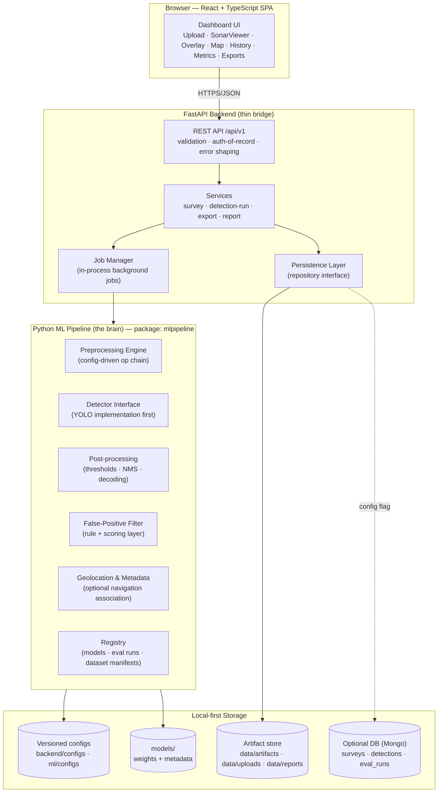

---

## SECTION 4 — Component Responsibilities

| Component | Technology | Responsibility | Input | Output |
|---|---|---|---|---|
| **Web SPA** | React 18 + TypeScript + Vite | Upload, visualization, history, metrics display, exports, report download; explicit "coordinates unavailable" states | User actions; JSON API responses | API requests; rendered dashboard |
| **API layer** | FastAPI + Pydantic v2 | HTTP boundary: file validation, request/response schemas, error shaping, CORS, request IDs | HTTP requests, multipart uploads | JSON responses, files, structured errors |
| **Job manager** | FastAPI `BackgroundTasks` + job store (JSON) | Track async jobs (survey batches, reports) with status/progress; single-process, MVP-safe | Job payloads | Job records (`pending/running/succeeded/failed`) |
| **Service layer** | Python | Orchestrate pipeline calls + persistence; owns use-cases (run inference, save detection, export) | Validated schemas | Domain results, artifacts |
| **Persistence layer** | Python repository interface | Abstract storage: file manifests now, Mongo later | Domain objects | Stored records + artifact paths |
| **Artifact store** | Local FS (`data/`) | Immutable originals, derived images, reports, exports; content-addressed where useful | Bytes/metadata | Paths + checksums |
| **Preprocessing engine** | Python + OpenCV/NumPy | Config-driven op chain (denoise, CLAHE, normalize, resize); reproducible via config hash | Image + `PreprocessConfig` | Processed image + applied-config record |
| **Sonar format readers** | Python | Read standalone images (PNG/TIFF/JPEG) and survey/log archives; extract navigation metadata when present | Files | `SonarImageRecord` + `NavigationSample[]` |
| **Detector interface** | Protocol/ABC | Uniform `load → predict` contract; returns raw model output only | Preprocessed image(s) + config | `RawDetection[]` (score, box, class id) |
| **YOLO implementation** | PyTorch + YOLO-family | Concrete detector; training via scripts, inference via interface | Dataset in YOLO format | Checkpoints + metrics |
| **Post-processing** | Python | Decode raw outputs: confidence threshold, NMS, box scaling back to source coordinates, class-name mapping | `RawDetection[]` + model meta | `Detection[]` (canonical, model-confidence only) |
| **False-positive filter** | Python rule engine | Deterministic rules + additive score → `final_confidence`, `filtering_status`, reasons | `Detection[]` + context (image stats, geo) | Filtered `Detection[]` |
| **Geolocation associator** | Python + Pandas | Map detection position → lat/lon from navigation log (interpolation by ping/time/track geometry); never fabricates | Navigation samples + detection positions | Optional lat/lon + provenance |
| **Model registry** | File-based (`models/registry.json`) | Immutable model versions: weights path, classes, preprocessing config hash, metrics, lineage | Training/eval outputs | Model version handles |
| **Evaluation module** | Python | mAP, precision/recall/F1, confusion matrix, per-class metrics, failure-case gallery; reproducible eval runs | Model version + dataset version + config | `EvaluationRun` record |
| **Reporting** | Python (Jinja2 HTML → PDF) | Detection summary report per run/survey | Canonical results | PDF + JSON report artifact |
| **Exporters** | Python | Canonical results → JSON / CSV (flat, stable column contract) | `Detection[]` | Files |
| **Map layer** | Leaflet + react-leaflet | Plot geolocated detections; graceful "no coordinates" mode | Detection geo data | Interactive map |
| **Configs** | YAML (versioned in Git) | Classes, thresholds, preprocessing presets, dataset definitions, app settings | — | Loaded config objects with content hashes |

---

## SECTION 5 — Complete Repository Structure

Monorepo. Three deployable/importable units: `backend` (FastAPI app), `ml` (pipeline package, importable by backend), `frontend` (SPA). `ml` must **never import FastAPI** — that dependency edge is enforced by a test.

```text
marine-debris-sonar/
├── README.md                          # Quickstart: dev up in <10 min
├── Makefile                           # make dev, train, eval, test, lint
├── docker-compose.yml                 # backend + frontend; optional mongo profile
├── .env.example                       # All env vars, no secrets
├── .gitignore                         # datasets/raw, models/weights, data/, .env
├── .editorconfig
│
├── docs/
│   ├── ARCHITECTURE.md                # This document (assembled)
│   ├── adr/                           # Architecture decision records
│   │   ├── ADR-001-modular-monolith.md
│   │   ├── ADR-002-detector-interface.md
│   │   ├── ADR-003-config-driven-preprocessing.md
│   │   ├── ADR-004-local-first-storage.md
│   │   ├── ADR-005-async-jobs-boundary.md
│   │   └── ADR-006-confidence-vs-filter-status.md
│   ├── dataset-notes/                 # Findings per candidate dataset (OPEN: sources)
│   │   └── TEMPLATE-dataset-review.md
│   └── runbooks/                      # Demo-day and failure recovery runbooks
│       └── demo-day.md
│
├── ml/                                # === Python ML pipeline (the brain) ===
│   ├── pyproject.toml                 # package: mlpipeline (torch, opencv, numpy, pandas)
│   ├── mlpipeline/
│   │   ├── __init__.py                # public API: load_pipeline, PipelineConfig
│   │   ├── config/
│   │   │   ├── schemas.py             # Pydantic config models (Preprocess, Detection, Filter, Dataset)
│   │   │   ├── loader.py              # YAML load, validate, content-hash, resolve paths
│   │   │   └── defaults/              # baseline.yaml, presets/*.yaml
│   │   ├── datatypes/                 # Canonical dataclasses (single source of truth)
│   │   │   ├── image.py               # SonarImage, ImageRecord
│   │   │   ├── detection.py           # RawDetection, Detection, FilterStatus enum
│   │   │   ├── navigation.py          # NavigationSample, NavigationTrack
│   │   │   ├── survey.py              # Survey, SurveyManifest
│   │   │   └── results.py             # InferenceResult, RunManifest
│   │   ├── io/                        # Sonar input readers (format adapters)
│   │   │   ├── base.py                # SonarReader protocol
│   │   │   ├── image_reader.py        # PNG/TIFF/JPEG standalone images
│   │   │   ├── survey_reader.py       # Archive readers (zip of images + log)   [OPEN: formats]
│   │   │   └── navigation/            # Parsers per nav format                  [OPEN: formats]
│   │   │       ├── base.py
│   │   │       └── generic_csv.py     # Timestamped lat/lon CSV fallback parser
│   │   ├── preprocessing/
│   │   │   ├── base.py                # PreprocessOp protocol: apply(img, ctx) -> img
│   │   │   ├── ops/                   # denoise.py, contrast.py, normalize.py, resize.py, enhance.py
│   │   │   ├── pipeline.py            # Ordered chain runner + context (scales, timings)
│   │   │   └── registry.py            # name -> op class; config references by name
│   │   ├── datasets/
│   │   │   ├── ingest.py              # Raw dataset -> interim layout
│   │   │   ├── formats/               # Converters (COCO->YOLO, VOC->YOLO, CSV->YOLO)
│   │   │   ├── validate.py            # Integrity checks, class distribution, corrupt scan
│   │   │   ├── split.py               # Deterministic train/val/test (stratified, seeded)
│   │   │   └── manifest.py            # dataset version manifests (content hashes)
│   │   ├── detection/
│   │   │   ├── base.py                # Detector protocol: load(), predict(), metadata
│   │   │   ├── yolo/
│   │   │   │   ├── adapter.py         # YOLODetector implements Detector
│   │   │   │   └── train_backend.py   # Training wrapper (ultralytics or torchvision) [OPEN]
│   │   │   ├── onnx_adapter.py        # Optional ONNXRuntime path for CPU demo
│   │   │   └── registry.py            # Model-version -> Detector instance factory
│   │   ├── postprocessing/
│   │   │   ├── decoder.py             # Raw outputs -> canonical boxes at source scale
│   │   │   ├── nms.py                 # Explicit, testable NMS (or delegated)
│   │   │   └── thresholds.py          # Confidence cutoff application (recorded, not hidden)
│   │   ├── filtering/
│   │   │   ├── base.py                # FilterRule protocol: evaluate(detection, ctx) -> Verdict
│   │   │   ├── rules/                 # min_size.py, aspect_ratio.py, edge_clip.py,
│   │   │   │                          # shadow_ratio.py [OPEN], class_rules.py
│   │   │   ├── scorer.py              # Additive penalty scoring -> final_confidence
│   │   │   └── pipeline.py            # Rule chain, status + reasons aggregation
│   │   ├── geolocation/
│   │   │   ├── associator.py          # Detection position -> NavigationSample interpolation
│   │   │   ├── geometry.py            # Track math (ping index/time along-track)
│   │   │   └── provenance.py          # How coords were derived (or null + reason)
│   │   ├── inference/
│   │   │   ├── engine.py              # SonarInferenceEngine: end-to-end single image
│   │   │   ├── batch.py               # Survey batch runner (used by async jobs)
│   │   │   └── tracing.py             # Per-stage timings, config hashes into result
│   │   ├── training/
│   │   │   ├── train.py               # CLI entrypoint wrapper
│   │   │   ├── augmentation.py        # Sonar-safe augs (flips, noise, no hue shifts)
│   │   │   └── experiment.py          # Run config capture -> models/<ver>/metadata
│   │   ├── evaluation/
│   │   │   ├── evaluate.py            # Eval-run runner (model x dataset x split)
│   │   │   ├── metrics.py             # mAP, P/R/F1, confusion matrix, per-class
│   │   │   └── failure_cases.py       # Export worst-N qualitative cases for UI/report
│   │   ├── registry/
│   │   │   ├── models.py              # models/registry.json read/write (append-only)
│   │   │   └── eval_runs.py           # evaluation run records
│   │   └── reporting/
│   │       ├── report.py              # Report builder (data assembly)
│   │       └── templates/             # Jinja2 HTML -> print-to-PDF
│   ├── configs/
│   │   ├── preprocessing/             # baseline_sonar.yaml, experiments/*.yaml
│   │   ├── detection/                 # thresholds, nms, class maps per model version
│   │   ├── filtering/                 # rules.yaml (enabled rules + params)
│   │   └── datasets/                  # dataset definitions: paths, format, classes
│   ├── scripts/                       # CLI: python -m ml.scripts.<x>
│   │   ├── inspect_dataset.py         # Phase 3 starting point: stats + visual sanity
│   │   ├── convert_dataset.py
│   │   ├── train.py
│   │   ├── evaluate.py
│   │   ├── predict_image.py           # Pipeline smoke-test without the API
│   │   └── benchmark_cpu.py           # CPU latency numbers for demo planning
│   ├── notebooks/                     # Exploration ONLY (never pipeline logic)
│   └── tests/
│       ├── unit/                      # ops, bbox math, filters, geo interp, configs
│       └── data/                      # Tiny synthetic fixtures (unit tests only)
│
├── backend/                           # === FastAPI bridge ===
│   ├── pyproject.toml                 # fastapi, uvicorn, pydantic v2, python-multipart
│   ├── app/
│   │   ├── main.py                    # App factory, routers, middleware, lifespan
│   │   ├── core/
│   │   │   ├── config.py              # Settings (pydantic-settings) from env/.env
│   │   │   ├── logging.py             # Structured JSON logs, request-ID middleware
│   │   │   ├── errors.py              # Error taxonomy -> HTTP mapping
│   │   │   └── security.py            # Filename sanitization, size/type guards, CORS
│   │   ├── api/v1/
│   │   │   ├── router.py              # Mounts all routers under /api/v1
│   │   │   ├── health.py
│   │   │   ├── uploads.py             # image + survey/log upload
│   │   │   ├── preprocessing.py       # preview endpoint
│   │   │   ├── inference.py           # run detection (sync) / job (batch)
│   │   │   ├── detections.py          # get/list, save, history
│   │   │   ├── exports.py             # json/csv export
│   │   │   ├── reports.py             # report generation/download
│   │   │   └── models.py              # model info + metrics
│   │   ├── schemas/                   # Pydantic API models (mirror canonical, not leak internals)
│   │   │   ├── common.py              # Error envelope, pagination, job status
│   │   │   ├── upload.py
│   │   │   ├── detection.py           # DetectionOut (null-able geo, filtering block)
│   │   │   ├── survey.py
│   │   │   ├── job.py
│   │   │   └── model_info.py
│   │   ├── services/
│   │   │   ├── survey_service.py      # upload -> survey record -> storage
│   │   │   ├── inference_service.py   # sync single-image path; enqueues batch jobs
│   │   │   ├── job_service.py         # job registry, progress, cancellation semantics
│   │   │   ├── export_service.py      # json/csv writers
│   │   │   ├── report_service.py
│   │   │   └── storage_service.py     # artifact store ops (save/open/checksum)
│   │   └── persistence/
│   │       ├── repository.py          # Interfaces: SurveyRepository, DetectionRepository, ...
│   │       ├── file_repository.py     # Default: JSON manifests under data/db/
│   │       └── mongo_repository.py    # Optional profile (MONGODB_ENABLED=true)
│   ├── tests/
│   │   ├── unit/                      # validation, exporters, error mapping
│   │   └── integration/               # TestClient: upload -> detect -> export
│   └── Dockerfile
│
├── frontend/                          # === React dashboard (no ML logic) ===
│   ├── package.json                   # Vite + React + TS, react-leaflet, react-query
│   ├── vite.config.ts                 # /api proxy -> localhost:8000 in dev
│   ├── tsconfig.json
│   ├── public/
│   └── src/
│       ├── main.tsx
│       ├── App.tsx                    # Router + layout shell
│       ├── api/
│       │   ├── client.ts              # Fetch wrapper: base URL, error envelope, abort
│       │   ├── endpoints.ts           # Typed functions per endpoint
│       │   └── types.ts               # Mirrors backend response schemas (generated or hand-synced)
│       ├── hooks/                     # useDetectionRun, useJobs, useModels, useQuery wrappers
│       ├── state/                     # Server state via react-query; minimal local UI state
│       ├── components/
│       │   ├── upload/                # UploadPanel, FileDropzone, FormatHints
│       │   ├── viewer/                # SonarViewer, DetectionOverlay, PreprocessPreview
│       │   ├── detections/            # DetectionList, DetectionDetails, ConfidenceIndicator,
│       │   │                          # FilterStatusBadge, CoordinatesBadge
│       │   ├── map/                   # MapView (Leaflet), NoLocationNotice
│       │   ├── metrics/               # MetricsPanel, PerClassTable, FailureCaseGallery
│       │   ├── reports/               # ReportActions (JSON/CSV/PDF buttons)
│       │   └── common/                # LoadingSpinner, ErrorBanner, EmptyState, ConfirmDialog
│       ├── pages/
│       │   ├── WorkbenchPage          # Upload -> preview -> run -> inspect (core demo flow)
│       │   ├── SurveyPage             # Batch survey jobs + progress
│       │   ├── HistoryPage            # Past runs/detections, filters
│       │   ├── ModelsPage             # Model info + metrics + failure cases
│       │   └── AboutPage              # Honest scope + limitations (judges read this)
│       └── styles/
│
├── e2e/                               # Playwright: upload -> detect -> map -> export
│   └── specs/
│
├── datasets/                          # Data NOT in Git (except manifests)
│   ├── README.md                      # How to obtain/place each dataset [OPEN: sources]
│   ├── manifests/                     # IN Git: versioned dataset manifests + hashes
│   ├── raw/                           # Gitignored: as-downloaded
│   ├── interim/                       # Gitignored: converted/validated
│   └── processed/                     # Gitignored: split YOLO-format sets
│
├── models/                            # Weights NOT in Git; registry IS
│   ├── registry.json                  # IN Git: model version index (lineage, metrics)
│   ├── weights/                       # Gitignored: model files per version
│   └── eval/                          # Per-version eval artifacts (metrics json, PR curves)
│
├── data/                              # All runtime artifacts (Gitignored), single root
│   ├── uploads/                       # Originals as received (immutable)
│   ├── artifacts/                     # Preprocessed images, run outputs
│   ├── reports/                       # Generated PDF/JSON reports
│   ├── exports/                       # CSV/JSON exports
│   ├── db/                            # File-based repository manifests (MVP "database")
│   └── tmp/                           # Scratch; cleaned on startup
│
└── scripts/                           # Repo-level utilities
    ├── setup_dev.sh                   # venvs, node modules, env scaffolding
    ├── seed_demo.py                   # Sample survey + detections for UI dev
    └── verify_env.py                  # Checks torch/CPU, disk, env vars
```

Design rules encoded in this tree:

1. **`ml` has no knowledge of HTTP.** Backend imports `mlpipeline`; never the reverse.
2. **`datasets/` and `models/` are split: Git-tracked manifests/indexes, Gitignored payloads.** Reproducibility without repo bloat.
3. **`data/` is the single runtime artifact root** — one env var (`DATA_ROOT`) relocates it entirely.
4. **`configs/` are versioned artifacts, referenced by content hash** in every result and model version.
5. Originals under `data/uploads/` are **immutable**; all derived content goes to `artifacts/` — traceability is path-based.
# Marine Debris Sonar AI — System Architecture (v1.0)
# Part 2: ML Core (Sections 6–10)

---

## SECTION 6 — ML Architecture

The ML subsystem is a layered pipeline. The binding contract is the **canonical dataclass layer** (`ml/datatypes/`): every stage consumes and produces these types, so any stage can be replaced without touching neighbors.

### 6.1 Lifecycle overview

```mermaid
flowchart LR
    A["Raw datasets<br/>(sources TBD)"] --> B["Ingest +<br/>format adapters"]
    B --> C["Dataset manifest<br/>(classes, hashes, stats)"]
    C --> D["Validate + split<br/>(seeded, stratified)"]
    D --> E["Preprocessing<br/>(config version)"]
    E --> F["Train detector<br/>(YOLO-family)"]
    F --> G["Evaluate<br/>(metrics + failure cases)"]
    G --> H["Register model<br/>version (immutable)"]
    H --> I["Serve via<br/>Detector interface"]
    I --> J["Post-process +<br/>filter + geolocate"]
    J --> K["Canonical results<br/>+ full provenance"]
```

### 6.2 Stage contracts

| Stage | Consumes | Produces | Key rule |
|---|---|---|---|
| Dataset ingestion | Raw downloads/exports | `datasets/interim/` + ingestion log | Never modifies originals in `raw/` |
| Format conversion | Interim data + target format spec | YOLO-format dataset dir + converter manifest | Converter id recorded per image |
| Validation | Converted dataset | Validation report (corrupt files, class distribution, bbox sanity, train/val/test leakage checks) | Fails loudly; no silent repair |
| Splitting | Validated dataset | Train/val/test file lists (deterministic, seeded, stratified by class and by source survey — prevents leakage from adjacent tiles) | Split seed stored in manifest |
| Preprocessing | Image + `PreprocessConfig` | Processed image + applied-config record | Same config hash at train & inference |
| Augmentation | Processed image | Augmented variants (train only) | Sonar-safe ops only: h-flip, v-flip, small rotations, noise, gain jitter, mosaic-like tiling. **No color-space tricks** (sonar is grayscale/intensity) |
| Training | YOLO dataset + config | Checkpoint + train metrics + run metadata | Run config snapshot saved beside weights |
| Evaluation | Model version + dataset version + split | `EvaluationRun` record + metrics + failure cases | Metrics on *system* output optionally (filter on/off) to report end-to-end numbers |
| Registry | Evaluated model | `models/registry.json` entry | Append-only; never overwrite entries |
| Inference | Image + model version + configs | `InferenceResult` (canonical detections + provenance) | Deterministic given same inputs + configs |

### 6.3 The Dataset → Model → Inference → Post-processing interface chain

```
SonarImage (datatypes/image.py)
    │  pixels + id + source path + nav context ref
    ▼
PreprocessingEngine.run(image, PreprocessConfig) → ProcessedSonarImage
    │  carries: processed array, scale factors, applied ops, config hash, timings
    ▼
Detector.predict(image: ProcessedSonarImage) → list[RawDetection]
    │  RawDetection: class_id, score, box_in_processed_space
    │  (Detector knows NOTHING about class names, filtering, or geolocation)
    ▼
PostProcessor.process(raw, model_meta, scale_factors) → list[Detection]
    │  canonical Detection: class NAME (from model's class map), model_confidence,
    │  bbox at SOURCE image coordinates, thresholds applied (recorded)
    ▼
FilterPipeline.apply(detections, context) → list[Detection]
    │  adds: final_confidence, filtering_status, filter_reasons[]
    │  (does NOT delete detections — status marks them; UI shows all with badges)
    ▼
Geolocator.associate(detections, navigation?) → list[Detection]
    │  fills lat/lon ONLY if real nav data exists; else null + reason
    ▼
InferenceResult { image_id, model_version, preprocess_hash, filter_config_hash,
                  detections[], timings, warnings }
```

Rules that make this chain replaceable:

1. **The `Detector` protocol never leaks into the API or frontend.** Swapping YOLO for a two-stage detector or ONNX model changes exactly one adapter file plus registry entries.
2. **Class names live in model metadata, not in code.** A `class_map` (id → name) is stored per model version and loaded by post-processing. Changing target classes = retrain + new model version; no application rewrite. The class list is a config input to training, not a constant.
3. **Thresholds are applied exactly once** — in post-processing — and the applied values are recorded in the result. Filtering never re-applies hidden thresholds.
4. **Model confidence is untouched** between detector and result. `model_confidence` and `final_confidence` are separate fields; the UI shows both when they differ.
5. **Filtering annotates, it doesn't destroy.** Rejected detections stay in the result with `filtering_status="rejected"` + reasons, so judges can see *what* the filter did. A query flag can hide them.

### 6.4 Model versioning & tracking

`models/registry.json` entry (append-only):

```json
{
  "model_version": "yolo-n-sonar-v0.3.1",
  "created_at": "2026-09-01T10:00:00Z",
  "architecture_family": "yolo",
  "checkpoint_path": "models/weights/yolo-n-sonar-v0.3.1/best.pt",
  "framework": "pytorch",
  "input_size": [640, 640],
  "class_map": {"0": "shipwreck", "1": "pipe", "2": "net", "3": "anomaly"},
  "preprocess_config_ref": {"path": "ml/configs/preprocessing/baseline_sonar.yaml", "sha256": "…"},
  "train_dataset_ref": {"manifest": "datasets/manifests/sonar-v0.2.json", "sha256": "…"},
  "train_config": {"epochs": 120, "batch": 16, "lr": 0.01, "seed": 42},
  "best_eval_ref": {"eval_run_id": "eval-2026-09-01-001"},
  "notes": "Added net class after second dataset review",
  "status": "active"
}
```

This is the authoritative answer to "which classes, which preprocessing, which data, which hyperparameters" for any deployed model.

### 6.5 Evaluation metrics storage

Each evaluation run produces an immutable record (see Section 13, `EvaluationRun`) plus artifacts: per-class metrics, confusion matrix JSON, PR curves (PNG), and a failure-case gallery (worst-N by score vs. ground truth). `models/eval/<model_version>/<eval_run_id>/` holds them; the registry entry links to it. Metrics shown in the UI **must come from these records**, never recomputed ad hoc in the backend.

### 6.6 What the model consumes / produces (concrete)

- **In:** preprocessed grayscale-intensity image (resized to model input size, e.g., 640×640; aspect preserved with letterbox — pad values recorded), possibly 3-channel-expanded (identity channels) for YOLO-family compatibility.
- **Out:** per-detection `class_id`, `score`, box in **processed-image pixel space** (never normalized coordinates at this layer).
- Scale factors (`scale_x`, `scale_y`, `pad_x`, `pad_y`) travel with the processed image so post-processing maps boxes back to **source coordinates** exactly once.

---

## SECTION 7 — Preprocessing Design

Preprocessing is an independent, configuration-driven subsystem. **No op is applied "just because"** — every op exists because a config selected it, and configurations are comparable experimentally.

### 7.1 Module shape

```
PreprocessOp (protocol)
  ├── name: str                    # stable registry key, e.g. "clahe"
  └── apply(img: np.ndarray, ctx: OpContext) -> np.ndarray

OpContext { source_image_id, stage_index, warnings[], timings[] }

PreprocessingEngine
  ├── load_config(PreprocessConfig) -> validates op names + params against registry
  ├── run(image, config) -> ProcessedSonarImage
  │     ├── processed: np.ndarray
  │   ├── scale_factors: {scale_x, scale_y, pad_x, pad_y}
  │   ├── applied_ops: [{op, params}]          # what actually ran
  │   ├── config_hash: sha256(canonical yaml)  # provenance
  │   └── timings: per-op milliseconds
```

### 7.2 Ops included at MVP (registry)

| Op | Purpose | Default config |
|---|---|---|
| `denoise_median` | Speckle/noise suppression | kernel 3, disabled by default (measure first) |
| `denoise_nlm` | Stronger denoise (slow) | experimental only |
| `clahe` | Contrast-limited adaptive histogram equalization — the standard win on sonar texture | clip 2.0, tile 8×8, **enabled** |
| `normalize_intensity` | Percentile-based robust normalization (1–99%) | enabled |
| `resize_letterbox` | Model-input sizing with recorded scale/pad | 640×640 |
| `optional_flip_waterfall` | Sonar waterfall orientation fix (port/starboard orientation) | **OPEN** — depends on reader format |

Experimental candidates (behind config, evaluated before adoption): bottom-track suppression, shadow enhancement, gain compensation across range. None are default.

### 7.3 Experimentability

`ml/configs/preprocessing/experiments/` holds named variants (e.g., `exp01-clahe-only.yaml`, `exp02-clahe-denoise.yaml`). The training/eval scripts accept a preprocessing config path, so a student can run: same model + same data + different preprocess config → compare `EvaluationRun` metrics. This is how "which preprocessing helps?" is answered with evidence, not vibes.

### 7.4 Reproducibility contract

1. Config file is content-hashed; the hash is stored with the model version **and** in every inference result.
2. Inference **loads the preprocessing config by hash from the model version's record** — not from the current default file. If someone edits the default config, running old models still reproduces their original behavior (hash mismatch warns loudly instead).
3. Preprocessing is deterministic: no random ops (randomness belongs to augmentation, train-only).

---

## SECTION 8 — Detection Architecture

### 8.1 The Detector abstraction

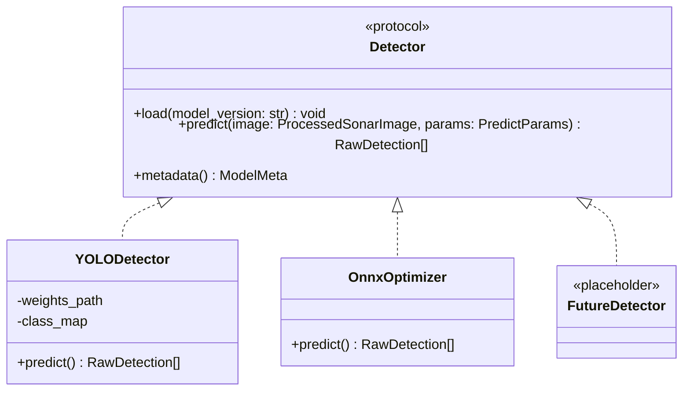

- `PredictParams`: per-request overrides allowed for **thresholds only** (e.g., "show me low-confidence too"), with the model's registered defaults used otherwise. Architecture/weights/class map are **never** per-request parameters.
- `ModelMeta`: version, architecture family, class map, input size, preprocess config ref, eval metrics summary. This is what `/api/v1/models/*` endpoints return — the API schema mirrors *this*, not PyTorch internals.

### 8.2 YOLO integration specifics

- Training via a thin wrapper (`yolo/train_backend.py`) around the chosen YOLO stack **[OPEN: `ultralytics` package vs `torchvision`-based implementation]**. The wrapper, not the framework, is imported everywhere.
- Class list flows: `ml/configs/datasets/<name>.yaml` defines candidate classes → training consumes it → model metadata stores the realized `class_map`. Application code never hardcodes class names.
- ONNX export path exists for CPU demo speedups, but is optional; PyTorch CPU inference is the guaranteed baseline.

### 8.3 Inference engine

`SonarInferenceEngine` orchestrates one image end-to-end and is the *only* object the backend calls for detection:

1. Read/validate source (via `io/` reader)
2. Preprocess (config from model version)
3. Predict (Detector)
4. Post-process (decode → thresholds → NMS → rescale to source coords, class names)
5. Filter (rule/scoring pipeline)
6. Geolocate (if nav context present)
7. Assemble `InferenceResult` with timings, hashes, warnings

Batch mode (`inference/batch.py`) runs the same engine per image over a survey, with progress callbacks consumed by the job manager. There is **no second inference path** — batch is a loop, not a re-implementation.

---

## SECTION 9 — False-Positive Filtering Architecture

### 9.1 Conceptual model

The detector is treated as a *proposer*, not an authority. A deterministic post layer converts raw proposals into a system verdict.

**Model confidence** = the detector's output score. It is *not* a calibrated probability of correctness; it is a ranking signal that varies with training data, class balance, and preprocessing.

**Final system confidence** = model confidence combined with deterministic, explainable penalties from rule evaluation. It is a decision-support score with recorded reasons — auditable, tunable, and honest about its nature.

### 9.2 Rule pipeline

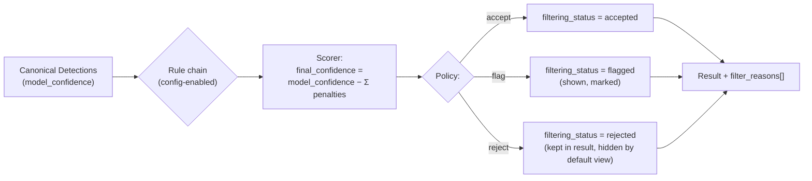

Each rule returns a `Verdict { penalty: 0–1, reason: str }`; the pipeline aggregates. Nothing is ever silently deleted.

### 9.3 MVP rule set (config-driven, each independently toggleable)

| Rule | Signal used | Rationale |
|---|---|---|
| `min_size` | bbox area vs image | Tiny boxes are usually seafloor texture noise |
| `aspect_ratio` | bbox dims | Extreme ratios usually shadows/water column artifacts |
| `edge_clip` | box touching image border | Clipped objects can't be assessed; flag, don't reject hard |
| `intensity_outlier` | region intensity stats vs image | Man-made objects often have distinctive return strength |
| `shadow_ratio` | dark region adjacent to box | Classic shipwreck/debris cue **[OPEN — effectiveness unproven until dataset review]** |
| `class_specific` | per-class param table | e.g., pipes are elongated; nets are large diffuse |
| `secondary_validator` *(stub)* | optional 2nd model | **Interface stub only** — not implemented at MVP; exists so a verifier can be added later without re-architecture |

### 9.4 Configuration example shape (not implementation)

```yaml
# ml/configs/filtering/rules.yaml
enabled_rules: [min_size, aspect_ratio, edge_clip, intensity_outlier]
rules:
  min_size: { min_area_frac: 0.0004 }
  aspect_ratio: { max_ratio: 8.0 }
  edge_clip: { penalty: 0.3 }
  intensity_outlier: { percentile_band: [10, 90] }
policy:
  accept_threshold: 0.60   # final_confidence >= this
  flag_threshold: 0.35     # between -> flagged
  # below flag_threshold -> rejected (still returned, marked)
```

The filter config hash is recorded in every result, exactly like the preprocessing hash. Filter behavior is thus reproducible per historical result.

### 9.5 Explicit non-goals

- No second neural verifier at MVP (stub interface only).
- No attempts to "learn" filter weights from limited data — rules stay hand-tuned and explainable until real evaluation data says otherwise.
- No deletion of detections anywhere in the pipeline.

---

## SECTION 10 — Geolocation + Metadata Architecture

### 10.1 Two input regimes

| Regime | Description | Geolocation behavior |
|---|---|---|
| **A: Standalone image** | Single PNG/TIFF/JPEG, no nav sidecar | All geo fields `null`, `geo_status="unavailable"`, human-readable reason. UI shows an explicit "no coordinates" state — never fake pins |
| **B: Survey/log** | Image set + navigation metadata (e.g., track log: timestamp/ping-index ↔ lat/lon/heading/altitude/speed) | Detections get real interpolated coordinates with provenance |

### 10.2 Navigation metadata abstraction

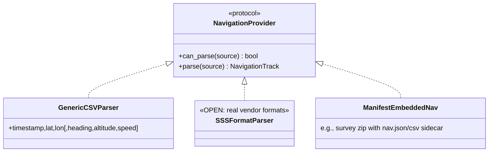

- Parsers are registered and probed in order (`can_parse` sniffing). Adding a vendor format = one new parser module + registry entry.
- `NavigationTrack` normalizes to: ordered samples of `{t_or_ping_index, lat, lon, heading?, altitude?, speed?, raw_row}` — **`raw_row` preserves the original metadata verbatim** for traceability.
- The exact real-world navigation formats are an **OPEN DECISION**; the `generic_csv` parser plus a documented sidecar convention is the MVP contract, with vendor parsers added after dataset inspection.

### 10.3 Association algorithm (conceptual)

Given a detection at position `(along_track_position)` within image *k* of survey *S*:

1. Determine detection's along-track position: ping index, timestamp, or relative position within the image swath (depends on what the reader extracted — **OPEN** until format review).
2. Interpolate between the two nearest `NavigationSample`s (linear in track distance; heading/speed interpolated likewise).
3. Emit `GeoProvenance`: `{ method: "linear_interp_along_track", samples_used: [id_a, id_b], uncertainty_m: estimate }`.

If any step lacks inputs: `lat/lon = null`, `geo_status` = one of `unavailable | missing_metadata | unparseable_metadata | inconsistent_track`, with the reason string surfaced to the UI. **The pipeline never invents coordinates — not defaults, not last-known-position, nothing.**

### 10.4 Traceability

Every detection carries: `source_file_id` (original upload), `image_id`, `survey_id` (if any), `navigation_record_ref` (raw nav row(s) used), plus model/preprocess/filter hashes. Given any stored detection, one can walk back to the exact original file and metadata rows — this is the auditable chain judges can be shown.
# Marine Debris Sonar AI — System Architecture (v1.0)
# Part 3: Application Layer (Sections 11–16)

---

## SECTION 11 — Backend Architecture

FastAPI is a thin, well-structured bridge. It owns **HTTP concerns only**: validation, orchestration of `mlpipeline` calls, persistence, jobs, exports, errors. All AI logic lives in `mlpipeline`.

### 11.1 Module responsibilities

| Module | Responsibility | Calls into |
|---|---|---|
| `app/main.py` | App factory, router mounting, middleware (request-ID, CORS), lifespan (load active model) | all routers |
| `core/config.py` | `Settings` via pydantic-settings: env + `.env` (paths, thresholds defaults, DB flags, CORS origins, max upload size) | — |
| `core/logging.py` | Structured JSON logs; binds `request_id` to every log line | — |
| `core/errors.py` | Error taxonomy → HTTP mapping (see 11.2); guarantees one response error envelope | services |
| `core/security.py` | Filename sanitization, extension + MIME + magic-byte checks, size guard, path confinement | storage_service |
| `api/v1/*` | Thin routers: parse request → call service → wrap response. No business logic beyond HTTP | services |
| `schemas/*` | Pydantic request/response models. **Mirror the canonical datatypes but never leak `mlpipeline` classes into responses** | — |
| `services/*` | Use-cases: validation, pipeline invocation, persistence, export/report orchestration, job enqueue | mlpipeline, persistence |
| `persistence/*` | Repository interfaces + file-backed implementation (+ optional Mongo) | storage_service |
| `services/job_service.py` | In-process async jobs (survey batches, report generation): persisted status records, progress %, polling endpoint | inference/batch |

### 11.2 Error taxonomy → HTTP mapping (uniform envelope)

All errors return: `{ "error": { "code", "message", "details?", "request_id" } }`.

| Code | HTTP | Trigger |
|---|---|---|
| `INVALID_IMAGE` | 422 | Undecodable/corrupt image |
| `UNSUPPORTED_FILE_TYPE` | 415 | Extension/MIME/magic-byte mismatch |
| `FILE_TOO_LARGE` | 413 | Above size limit |
| `CORRUPT_SONAR_DATA` | 422 | Reader fails on survey/log archive |
| `MISSING_METADATA` | 200* | Nav data absent — *not an error*; geo fields null + `geo_status` (surfaced as result warning) |
| `INVALID_COORDINATES` | 200* | Nav present but malformed/unparseable rows — result proceeds with `geo_status="unparseable_metadata"` |
| `MODEL_UNAVAILABLE` | 503 | Registry entry/weights missing at startup or request |
| `INFERENCE_FAILED` | 500 | Detector threw; logged with request-id + model version |
| `PREPROCESSING_FAILED` | 500 | Op failure; includes failing op name |
| `NOT_FOUND` | 404 | Unknown detection/survey/model/job id |
| `STORAGE_UNAVAILABLE` | 503 | Disk/DB failure |
| `REPORT_GENERATION_FAILED` | 500 | Template/render failure |
| `VALIDATION_ERROR` | 422 | Pydantic request validation |

*) Design choice: metadata problems are **result warnings**, not HTTP errors — the detection still happened. HTTP errors are reserved for "the operation could not be performed at all".

### 11.3 Sync vs async rule

- **Sync:** single-image inference (CPU YOLO-n scale ≈ hundreds of ms to a few seconds), preprocess preview, exports of existing results.
- **Async (background job + polling):** survey/log batch inference (potentially hundreds of images), report generation. Job record: `{job_id, type, status, progress, result_ref, errors[]}` persisted so a page refresh loses nothing. This needs **no Redis/Celery** — a persisted in-process job table suffices for a single-node SIH demo; the `job_service` interface is the future seam for a real queue if ever needed.

### 11.4 Lifespan behavior

On startup: load active model version (from registry, overridable by env `ACTIVE_MODEL_VERSION`), validate configs, warm storage dirs, log versions. On model load failure: app starts in degraded mode — health endpoint reports `model: unavailable`, detection endpoints return `MODEL_UNAVAILABLE`, everything else works. A demo never dies completely because of a weights file.

---

## SECTION 12 — API Contract

Base: `/api/v1`. All responses JSON unless downloading a file. Errors use the envelope from 11.2.

| Method | Endpoint | Purpose | Request | Response | Errors |
|---|---|---|---|---|---|
| GET | `/health` | Liveness + component status (model, storage, version) | — | `{status, model: {version, loaded}, storage_ok, app_version}` | — |
| POST | `/uploads/image` | Upload standalone sonar image | multipart: `file` (PNG/TIFF/JPEG) | `201 {image_id, filename, size_bytes, sha256, format, width, height, has_metadata}` | `UNSUPPORTED_FILE_TYPE`, `FILE_TOO_LARGE`, `INVALID_IMAGE` |
| POST | `/uploads/survey` | Upload survey/log archive (images + navigation) | multipart: `file` (zip) + optional `name` | `201 {survey_id, name, image_count, navigation_status, images[]}` (sync) or `202 {job_id}` if large **[OPEN: threshold]** | `UNSUPPORTED_FILE_TYPE`, `CORRUPT_SONAR_DATA`, `FILE_TOO_LARGE` |
| POST | `/previews/preprocess` | Preprocessed preview without detection | `{image_id, preprocess_config?(inline or named preset)}` | `{preview_url (processed PNG), applied_ops[], config_hash, scale_factors, timings_ms}` | `INVALID_IMAGE`, `PREPROCESSING_FAILED`, `NOT_FOUND` |
| POST | `/detections/run` | Run inference on one uploaded image (sync) | `{image_id, model_version?, overrides?: {confidence_threshold?}, save?: bool}` | `201 InferenceResult` (full canonical result; `save` persists and returns `detection_run_id`) | `MODEL_UNAVAILABLE`, `INFERENCE_FAILED`, `PREPROCESSING_FAILED`, `NOT_FOUND` |
| POST | `/surveys/{survey_id}/run` | Batch inference over survey (async) | `{model_version?, save?: bool}` | `202 {job_id}` | `MODEL_UNAVAILABLE`, `NOT_FOUND` |
| GET | `/jobs/{job_id}` | Poll job status/progress | — | `{job_id, type, status, progress_pct, result_ref?, errors[]}` | `NOT_FOUND` |
| GET | `/detections/runs/{run_id}` | Get one full inference run result | — | `InferenceResult` | `NOT_FOUND` |
| GET | `/detections` | Detection history (paginated, filterable) | query: `page,size,survey_id,image_id,class,status,date_from,date_to` | `{items: DetectionSummary[], total, page}` | — |
| GET | `/detections/{detection_id}` | Single detection with full provenance | — | `DetectionOut` | `NOT_FOUND` |
| PATCH | `/detections/{detection_id}` | Analyst override of filtering status (accept/reject a flagged item) | `{status, note?}` | `DetectionOut` | `NOT_FOUND`, `VALIDATION_ERROR` |
| GET | `/surveys` | List surveys | query: `page,size` | `{items: SurveySummary[], total}` | — |
| GET | `/surveys/{survey_id}` | Survey detail + image list + nav status | — | `SurveyOut` | `NOT_FOUND` |
| GET | `/exports/detections.json` | Export filtered detection set | same filters as `/detections` | `application/json` file (download) | — |
| GET | `/exports/detections.csv` | CSV export, stable column contract | same filters | `text/csv` file | — |
| POST | `/reports` | Generate survey/run report (async) | `{survey_id or run_id, format: "pdf"}` | `202 {job_id}` | `NOT_FOUND`, `REPORT_GENERATION_FAILED` |
| GET | `/reports/{report_id}` | Download report artifact | — | `application/pdf` file | `NOT_FOUND` |
| GET | `/models` | List registered model versions | — | `{items: ModelVersionSummary[]}` | — |
| GET | `/models/{model_version}` | Model detail: classes, input size, preprocess ref | — | `ModelVersionOut` | `NOT_FOUND` |
| GET | `/models/{model_version}/metrics` | Latest EvaluationRun metrics (+ per-class, confusion matrix) | — | `EvaluationRunOut` | `NOT_FOUND` |
| GET | `/images/{image_id}` | Original image file | — | image bytes | `NOT_FOUND` |
| GET | `/images/{image_id}/processed` | Preprocessed image artifact | query: `run_id` | image bytes | `NOT_FOUND` |

Contract rules: (1) `model_version` is always optional with the active model as default, but **echoed in every response**; (2) geo fields are `null`-able everywhere — clients must render "unavailable", never "0,0"; (3) every response carries `request_id`; (4) list endpoints paginate.

---

## SECTION 13 — Data Models

Canonical internal models (Pydantic, single source of truth in `ml/datatypes/`; API schemas mirror them):

### Survey
```jsonc
{
  "survey_id": "srv_01H9...",
  "name": "Mumbai coastal pass 2026-08",
  "created_at": "…",
  "source_archive": "data/uploads/…",
  "image_count": 214,
  "images": ["img_..."],                       // SonarImage ids
  "navigation": {
    "status": "present | absent | unparseable",
    "format": "generic_csv | vendor_x | …",     // null if absent
    "track_ref": "artifacts/nav/...json",
    "sample_count": 1200,
    "time_range": ["…", "…"]                    // or ping-index range
  },
  "notes": ""
}
```

### SonarImage
```jsonc
{
  "image_id": "img_01H9...",
  "survey_id": null,                            // null for standalone upload
  "source_path": "data/uploads/2026/09/img_….png",   // immutable original
  "sha256": "…",
  "format": "png | tiff | jpeg | …",
  "width": 1024, "height": 512,
  "captured_at": null,                          // from nav/embedded metadata if any
  "acquisition_metadata": { },                  // verbatim passthrough (ping index, frequency, range…)
  "geo_context": { "status": "present | absent | unparseable" }
}
```

### Detection (canonical result unit)
```jsonc
{
  "detection_id": "det_01H9...",
  "run_id": "run_01H9...",
  "image_id": "img_01H9...",
  "class_name": "pipe",                         // resolved via model class_map — never a bare id
  "model_confidence": 0.91,                     // raw detector score, untouched
  "final_confidence": 0.84,                     // after filter penalties
  "filtering_status": "accepted | flagged | rejected",
  "filter_reasons": ["aspect_ratio: 9.2 > 8.0 (penalty 0.07)"],
  "bbox_source_coords": [120, 80, 300, 240],    // [x, y, w, h] in ORIGINAL image pixels
  "bbox_processed_coords": [96, 64, 240, 192],  // model-space box (debugging aid)
  "mask": null,                                  // RLE/polygon — OPEN until bbox-vs-segmentation decided
  "latitude": 19.0760,                           // null when unavailable — never fabricated
  "longitude": 72.8777,
  "geo_status": "present | unavailable | missing_metadata | unparseable_metadata | inconsistent_track",
  "geo_provenance": { "method": "linear_interp_along_track", "samples_used": ["s12","s13"], "uncertainty_m": 2.4 },
  "model_version": "yolo-n-sonar-v0.3.1",
  "preprocess_config_hash": "…",
  "filter_config_hash": "…",
  "created_at": "…"
}
```

### DetectionRun (a.k.a. inference result record)
```jsonc
{
  "run_id": "run_01H9...",
  "kind": "single_image | survey_batch",
  "image_id": "… | null", "survey_id": "… | null",
  "model_version": "…", "preprocess_config_hash": "…", "filter_config_hash": "…",
  "overrides_applied": { },                      // e.g. lowered threshold for this run
  "detections": ["det_..."],
  "timings_ms": { "read": 3, "preprocess": 11, "inference": 480, "postprocess": 5, "filter": 2, "geolocate": 1 },
  "warnings": ["navigation metadata missing — coordinates unavailable"],
  "created_at": "…"
}
```

### ModelVersion
```jsonc
{
  "model_version": "yolo-n-sonar-v0.3.1",
  "architecture_family": "yolo",                 // final arch is OPEN; family recorded, not assumed
  "checkpoint_path": "models/weights/…",
  "class_map": { "0": "shipwreck", "1": "pipe", "2": "net", "3": "anomaly" },
  "input_size": [640, 640],
  "preprocess_config_ref": { "path": "…", "sha256": "…" },
  "train_dataset_ref": { "manifest": "…", "sha256": "…" },
  "train_config": { "epochs": 120, "batch": 16, "lr": 0.01, "seed": 42 },
  "best_eval_ref": "eval_…",
  "status": "active | shadow | retired",
  "created_at": "…", "notes": "…"
}
```

### EvaluationRun
```jsonc
{
  "eval_run_id": "eval_2026-09-01_001",
  "model_version": "…",
  "dataset_ref": { "manifest": "datasets/manifests/sonar-v0.2.json", "sha256": "…" },
  "split": "test",                               // evaluation split used
  "split_seed": 42,
  "preprocess_config_hash": "…",
  "filter_config_hash": "…",                     // metrics with filter ON vs OFF recorded separately
  "metrics": { "mAP50": 0.41, "mAP50_95": 0.27, "precision": 0.55, "recall": 0.38, "f1": 0.45 },
  "per_class": { "pipe": { "ap50": 0.6, "precision": 0.7, "recall": 0.5 }, "…": { } },
  "confusion_matrix_ref": "models/eval/…/confusion.json",
  "pr_curve_refs": ["models/eval/…/pr_pipe.png"],
  "failure_case_refs": ["models/eval/…/failures/…"],
  "hyperparameters": { }, "timestamp": "…", "notes": "…"
}
```

### Report
```jsonc
{
  "report_id": "rpt_01H9...",
  "kind": "survey_summary | run_summary",
  "subject_ref": "survey_id or run_id",
  "format": "pdf",
  "artifact_path": "data/reports/…pdf",
  "generated_at": "…", "model_version": "…",
  "content_stats": { "images": 214, "detections": 37, "accepted": 22, "flagged": 9, "rejected": 6 }
}
```

Mongo collections (if enabled) map 1:1: `surveys`, `sonar_images`, `detection_runs`, `detections`, `model_versions`, `evaluation_runs`, `reports`, `jobs`. The file-backed repository writes these same documents as JSON manifests under `data/db/` — identical shapes, so switching storage is a repository swap, not a data-model change.

---

## SECTION 14 — Frontend Architecture

### 14.1 Pages

| Page | Purpose |
|---|---|
| **WorkbenchPage** (home) | The demo flow: Upload → (optional) preprocess preview → Run detection → inspect results |
| **SurveyPage** | Survey uploads, batch job progress, per-image drill-down |
| **HistoryPage** | Detection runs/detections with filters; open any run |
| **ModelsPage** | Model versions, class lists, metrics, confusion matrix, failure-case gallery |
| **AboutPage** | Honest scope, limitations, dataset provenance — judges' credibility page |

### 14.2 Core components

- **UploadPanel / FileDropzone** — drag-drop, client-side extension/size pre-checks, format hints (real supported formats only, driven by a capabilities endpoint/config — no promising vendor formats that don't parse yet).
- **SonarViewer** — canvas rendering of the sonar image with pan/zoom; base for overlays.
- **DetectionOverlay** — draws bboxes (and masks later if chosen) colored by class, badge per box; renders model vs final confidence distinctly.
- **DetectionList / DetectionDetails** — class, `ConfidenceIndicator` (bar for both confidence types), `FilterStatusBadge` (accepted/flagged/rejected + reasons tooltip), `CoordinatesBadge` (real coords or explicit "location unavailable"), bbox coordinates.
- **MapView** (react-leaflet) — plots geolocated detections as markers; `NoLocationNotice` empty-state explaining *why* coordinates are missing; never plots null coords as 0,0.
- **PreprocessPreview** — side-by-side raw vs processed with applied ops list and config name.
- **MetricsPanel / PerClassTable / FailureCaseGallery** — read-only rendering of stored EvaluationRun data.
- **ReportActions** — JSON/CSV download + PDF report trigger (job-aware button states).
- **common/** — `LoadingSpinner`, `ErrorBanner` (renders the API error envelope humanely), `EmptyState`, `JobProgress`.

### 14.3 State & data

- **Server state:** TanStack Query — caching, polling (jobs), retries. No global Redux; there is no complex client state worth it.
- **Local UI state:** React context for current run/selection (Workbench), URL params for deep-linkable views (history filters).
- **API layer:** single `client.ts` (fetch wrapper: base URL, JSON, error envelope parsing, abort support) + typed endpoint functions in `endpoints.ts`; `types.ts` mirrors Section 13 schemas. Detection rendering logic = mapping JSON to SVG/canvas shapes — **no thresholds, scoring, or class logic in TS**.
- **Environment:** `VITE_API_BASE_URL` (dev: Vite proxy `/api` → `localhost:8000`).

### 14.4 Explicit frontend rules

1. Never compute, re-rank, or re-threshold detections client-side.
2. Never render fabricated coordinates; render the missing-data state.
3. Always show `filtering_status`; rejected items hidden behind a toggle, not deleted.
4. Every async action surfaces job progress + failure reasons verbatim from the API.

---

## SECTION 15 — Storage Architecture

| Layer | Location | Contents | Why |
|---|---|---|---|
| **File/object storage** | `data/uploads/` | Originals, immutable, content-hash-named dirs | Evidence integrity; reprocessing always possible |
| | `data/artifacts/` | Preprocessed images, per-run outputs, nav extracts | Derived data separable from originals |
| | `data/reports/`, `data/exports/` | PDFs, CSV/JSON downloads | User-facing artifacts, cheap to regenerate |
| **Database (repository)** | `data/db/*.json` (MVP) or MongoDB (flag) | Section 13 documents: surveys, sonar_images, detection_runs, detections, model_versions, evaluation_runs, reports, jobs | Structured queries (history, filters); file-backed = zero infra, Mongo = same shapes when needed |
| **Model storage** | `models/weights/<version>/` + `models/registry.json` (in Git) | Checkpoints (Gitignored) + append-only registry index | Weights big; lineage tiny and reviewable |
| **Eval artifacts** | `models/eval/<version>/<eval_run_id>/` | Metrics JSON, PR curves, confusion matrix, failure cases | First-class ML evidence, linked from registry |
| **Temporary** | `data/tmp/` | In-flight uploads, scratch; wiped on startup | Keeps failure modes clean |

Decision record: MongoDB is **not** an MVP dependency. The repository interface (`persistence/repository.py`) defines the contract; `file_repository` implements it with per-collection JSON manifests + an index file. Concurrency caveat is documented (single-process assumption); Mongo activation is a settings change for multi-user demo scenarios **[OPEN: DB necessity]**.

---

## SECTION 16 — Complete Data Flow

End-to-end, single-image sync path (the demo core):

```
1. User drops file in UploadPanel
2. frontend: client-side pre-checks (ext/size) → POST /uploads/image (multipart)
3. FastAPI: size/extension/magic-byte validation → sanitize filename
4. storage_service: write immutable original to data/uploads/, compute sha256
5. io/image_reader: decode, extract basic props (+ embedded metadata if format allows)
6. SonarImage record persisted; image_id returned → frontend shows thumbnail
7. (Optional) POST /previews/preprocess → PreprocessingEngine runs configured chain
   → processed PNG stored under data/artifacts/ → preview_url + applied ops + timings
8. User clicks "Run detection" → POST /detections/run {image_id}
9. inference_service → SonarInferenceEngine.run():
   9a. read source (from uploads)
   9b. load preprocessing config BY HASH from model version record → preprocess
   9c. Detector.predict() → RawDetection[] (scores + boxes, model space)
   9d. PostProcessor: threshold → NMS → rescale to source coords → class names → Detection[]
   9e. FilterPipeline: rules → penalties → final_confidence + status + reasons
   9f. Geolocator: nav context? interpolate → lat/lon + provenance; else null + reason
   9g. assemble InferenceResult (+ timings, hashes, warnings)
10. (save=true) persist DetectionRun + Detections via repository
11. JSON response → frontend renders:
    SonarViewer + DetectionOverlay (boxes/badges)
    DetectionList/Details (both confidences, filter status, coords or "unavailable")
    MapView (markers only for geo-present detections)
12. User actions:
    - analyst override (PATCH /detections/{id}) on flagged items
    - GET /exports/detections.csv|json → download
    - POST /reports → job → GET /jobs/{id} → GET /reports/{id} → PDF
13. Every step logs with request_id; every result carries model_version + config hashes
```

Survey batch path differs only at steps 8–11: `POST /surveys/{id}/run` → job record → `inference/batch.py` loops the identical engine per image with progress callbacks → frontend polls `GET /jobs/{id}` → results browsable per image + aggregated on SurveyPage/MapView.
# Marine Debris Sonar AI — System Architecture (v1.0)
# Part 4: Diagrams, Testing, Deployment, Security (Sections 17–20)

---

## SECTION 17 — Mermaid Architecture Diagrams

### 17.1 ML inference pipeline (per image)

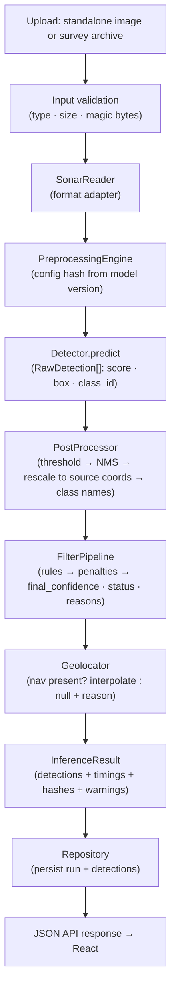

### 17.2 End-to-end data flow

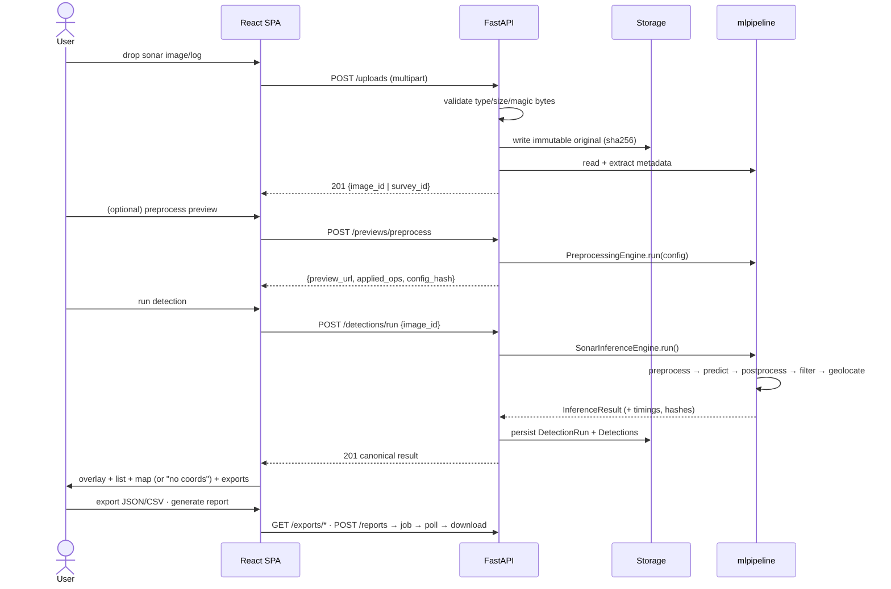

### 17.3 Backend module architecture

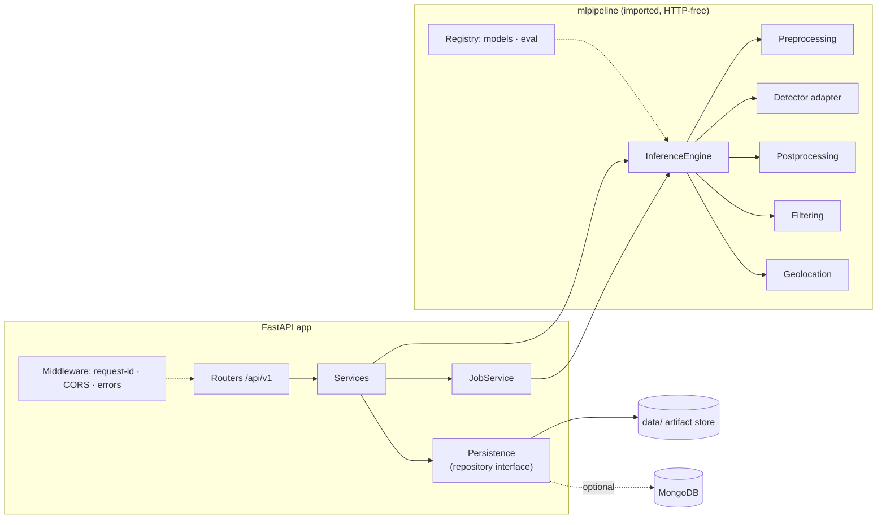

### 17.4 Frontend architecture

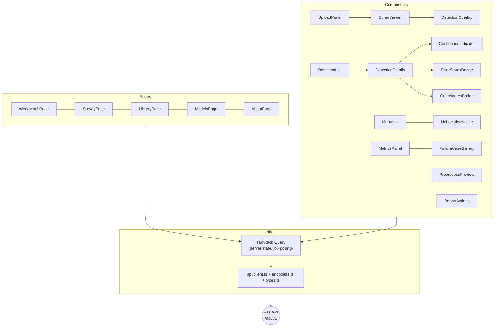

### 17.5 Storage relationships

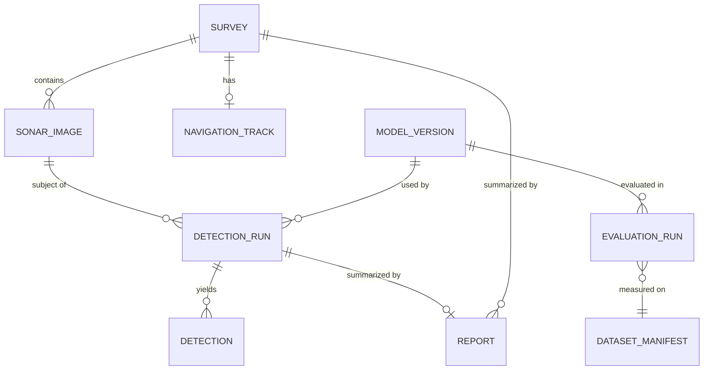

### 17.6 Training/evaluation pipeline

```mermaid
flowchart LR
    A["datasets/raw<br/>(as downloaded)"] --> B["ingest +<br/>validate"]
    B --> C["convert to<br/>YOLO format"]
    C --> D["stratified split<br/>(seeded, leak-checked)"]
    D --> E["train<br/>(config snapshot saved)"]
    E --> F["evaluate<br/>(test split, filter on/off)"]
    F --> G["register model<br/>version (append-only)"]
    G --> H["metrics + PR curves +<br/>failure gallery stored"]
    H --> I["promote to active<br/>(registry status)"]
```

### 17.7 Deployment architecture

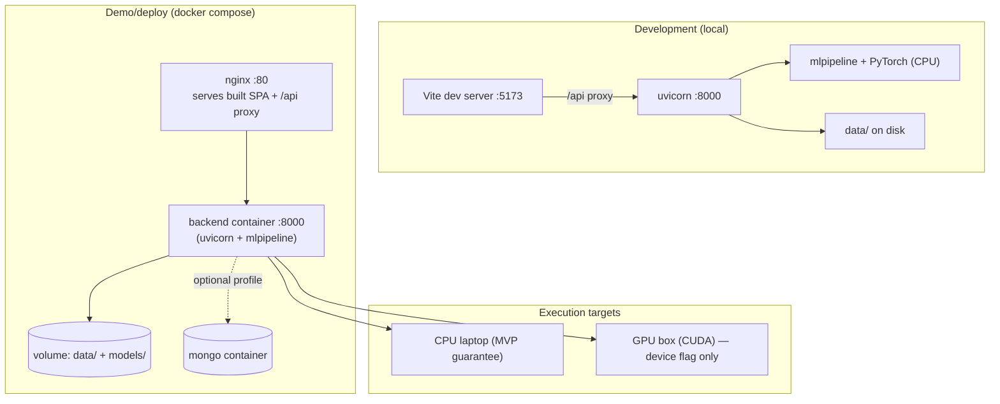

---

## SECTION 18 — Testing Architecture

### 18.1 Layers

| Layer | Scope | Representative cases | Tooling |
|---|---|---|---|
| **Unit — ML** | Pure functions | Preprocess ops (shapes, dtype, determinism given fixed input, config-hash stability); bbox rescale math (letterbox round-trip); NMS; filter rules (penalty math, edge cases: tiny box, border box); geo interpolation (exact sample, between samples, missing track); config schemas reject invalid YAML | pytest, fixtures under `ml/tests/data/` |
| **Unit — backend** | HTTP-independent logic | Error→HTTP mapping; CSV column contract (golden file); filename sanitization; settings parsing | pytest |
| **Integration — backend** | TestClient with temp `DATA_ROOT`, tiny real-ish fixture model or stub Detector | Upload→detect→result; upload invalid file → correct error envelope; save → history → export JSON/CSV round-trip; job lifecycle for batch stub | pytest + FastAPI TestClient |
| **Contract** | API schema ↔ frontend types | Generated OpenAPI snapshot; frontend `types.ts` sync test | CI script |
| **ML evaluation** | Model quality, run via `ml/scripts/evaluate.py` | mAP/P/R/F1 per class, confusion matrix, metrics **with filter ON and OFF**; failure-case gallery; dataset sanity (class distribution, leakage checks) | same eval runner as production; results are `EvaluationRun` records |
| **E2E** | Full stack via Playwright | Upload sample → run → boxes render → history → export → report job completes; "no coordinates" state visible for image without nav | Playwright |
| **Lint/boundaries** | Architecture rules | `ml` must not import FastAPI; frontend must not contain threshold constants; no class names hardcoded in app code | import-linter + simple grep test |

The boundary/lint tests are deliberate: they *enforce* the architectural principles with CI instead of trust.

### 18.2 ML evaluation as first-class citizen

- Evaluation uses the **same** preprocessing config (by hash) and the same post-processing defaults as serving — eval numbers reflect deployed behavior.
- Metrics are never hand-copied into slides from a notebook; the UI ModelsPage renders stored `EvaluationRun` records, so numbers shown to judges are traceable to data+model+config versions.
- A "smoke model" (tiny model, tiny dataset, few epochs) exists in CI as an ML *plumbing* test — verifying the train→eval→registry→serve chain works end-to-end, explicitly **not** claiming detection quality.

---

## SECTION 19 — Deployment Architecture

### 19.1 Development (the default)

- `make dev`: two processes — `uvicorn app.main:app --reload` (backend, port 8000) and `npm run dev` (Vite, port 5173, `/api` proxied).
- Model: CPU PyTorch by default; `DEVICE=cuda` auto-detected via torch if present.
- Storage: local `data/`; no external services. MongoDB off.

### 19.2 Demo/deployment (docker-compose)

- **frontend:** multi-stage build → static assets served by nginx, which also proxies `/api` → backend (single origin; CORS trivial).
- **backend:** slim Python image with PyTorch CPU wheels; models baked or mounted via `models/` volume; `data/` on a named volume.
- **mongo:** optional compose profile (`--profile mongo`) — not started by default.
- **GPU variant:** same backend image + `nvidia-container-toolkit` runtime and `DEVICE=cuda`; identical code path (device is a setting).

### 19.3 Environment variables (single source: `.env.example`)

| Var | Purpose |
|---|---|
| `DATA_ROOT` | Relocates entire `data/` tree |
| `MODELS_DIR`, `ACTIVE_MODEL_VERSION` | Registry location; which version serves |
| `DEVICE` | `auto \| cpu \| cuda` |
| `CONFIDENCE_THRESHOLD`, `IOU_THRESHOLD` | Serving defaults (overridable per request within bounds) |
| `MAX_UPLOAD_MB`, `ALLOWED_EXTENSIONS` | Upload guards |
| `CORS_ORIGINS` | Dev: `http://localhost:5173`; demo: same-origin via nginx |
| `MONGODB_ENABLED`, `MONGODB_URL` | Storage backend switch |
| `LOG_LEVEL` | `INFO` default; `DEBUG` for demos prep |

No secrets exist at MVP (no auth provider, no external API keys); if any appear later, `.env` (Gitignored) only, never committed.

### 19.4 Realism constraints

- Single node assumption is explicit (job store, file repo). This is *documented*, not hidden — scaling out means swapping `job_service` + `repository` implementations, both of which are interfaces.
- CPU latency budget: a YOLO-n class model at 640px on CPU ≈ 0.3–2 s/image (to be measured by `benchmark_cpu.py` and recorded in the README — demo flow sized accordingly; survey batches run async).

---

## SECTION 20 — Security

Practical, proportionate measures (SIH prototype scale):

| Measure | Implementation |
|---|---|
| File type validation | Extension **and** MIME **and** magic-byte checks; allowlist from settings (`ALLOWED_EXTENSIONS`) |
| File size limits | Enforced at API layer (`MAX_UPLOAD_MB`) before body fully buffered; streaming upload to disk |
| Safe file names | Server-generated IDs for stored artifacts; original filename kept only as metadata field, sanitized (no paths, no control chars) |
| Path traversal prevention | All storage paths built from server-side IDs + validated config roots; a unit test asserts `../` and absolute-path inputs cannot escape `DATA_ROOT` |
| Upload isolation | Originals written to `data/uploads/`, never executed, never served from the API origin with execute-ish MIME types (downloads use `Content-Disposition: attachment`) |
| API validation | Pydantic schemas on every request; unknown fields rejected; bounded pagination sizes |
| CORS | Explicit origin allowlist from settings; no wildcard in any environment |
| Secrets | None at MVP; env-var-only configuration; `.env` Gitignored; `.env.example` documents keys |
| Input sanitization | Survey names/notes rendered as text (React escapes by default); report templates escape all interpolated values |
| Dependency hygiene | Pinned dependency versions; `pip-audit`/`npm audit` in CI (advisory) |
| Auth | **Out of scope for MVP** — documented explicitly; the API is LAN/demo-scoped. If required later: single shared-token middleware seam already exists in middleware stack |

Anti-over-engineering note: no rate limiting, WAF, or full RBAC — the threat model is "curious LAN peer", not the open internet, until deployment targets change.
# Marine Debris Sonar AI — System Architecture (v1.0)
# Part 5: Phases, Risks, ADRs, Governance (Sections 21–26 + Appendix A)

---

## SECTION 21 — Development Phases

Each phase ends with a verifiable exit criterion, so phases are independently testable.

| Phase | Focus | Deliverables | Exit criterion |
|---|---|---|---|
| **0 — Concepts** | Problem framing, judging criteria, honesty boundaries | `docs/dataset-notes/`, glossary, success-metric sketch | Team can state what "a detection" means and what will NOT be claimed |
| **1 — Python foundation** | `mlpipeline` skeleton, canonical datatypes, config loader | Package + tests; `predict_image.py` runs a trivial pass-through detector | `pytest` green; config hash provenance works |
| **2 — Sonar preprocessing** | Op registry + engine + experiment configs | Baseline config; preview-capable engine; per-op unit tests | Deterministic output; processed vs raw visually sane; timings logged |
| **3 — Dataset** | Ingestion, inspection, conversion, validation, split | `inspect_dataset.py` report; dataset manifest; YOLO-format set | Manifest with classes + hashes committed; **class list finalized here** (closes an OPEN decision) |
| **4 — AI model** | Training wrapper, eval, registry | Trained model version + EvaluationRun (metrics + failure cases) | Registered model with stored metrics on test split; CPU inference works |
| **5 — Smart filtering** | Rule/scoring pipeline + configs | Filtering layer with statuses/reasons; eval with filter ON vs OFF | Filter demonstrably reduces false positives on val set without killing recall (documented trade-off) |
| **6 — FastAPI** | Full API per Section 12 + file persistence + jobs | Running service, integration tests, OpenAPI frozen | Upload→run→export works via HTTP alone (curl script) |
| **7 — React dashboard** | SPA per Section 14 wired to real API | All pages live; map, overlays, exports, metrics page | E2E Playwright flow green; no ML logic in `frontend/` (lint-enforced) |
| **8 — SIH polish** | Demo dataset, seed script, runbooks, failure-case page | `seed_demo.py`, demo-day runbook, AboutPage honesty content | Fresh-machine demo succeeds in <10 min from README |

Effort guardrails (per priority: AI 60 / data 20 / dashboard 15 / polish 5): Phases 1–5 ≥ 60% of calendar time; frontend work starts only after Phase 6 API exists; any UI task > 1 day must justify itself against the AI pipeline backlog.

---

## SECTION 22 — Risks and Mitigations

| # | Risk | Likelihood | Impact | Mitigation (architectural, not hopeful) |
|---|---|---|---|---|
| 1 | **No suitable public sonar debris dataset exists** (the #1 risk) | High | Fatal | Architecture is dataset-first: Phase 3 is inspection/conversion, not modeling. Multiple-format converters; class list emerges from data. If data is too scarce: honest fallback = detector on best-available sonar classes + explicitly labeled limited-scope demo, plus documented synthetic-data usage as **development aid only** (never presented as validation) |
| 2 | **Dataset found but tiny/imbalanced** (hundreds, not thousands of samples) | High | High | Heavy augmentation budget (sonar-safe ops); small-model choice (YOLO-n scale); class-specific rules in filter; evaluation always reports per-class metrics; no claim of generalization beyond the test split's domain |
| 3 | **Annotation quality/consistency unknown** | Medium | High | Validation stage checks label sanity (bbox plausibility, class distribution); per-source-survey stratification in splits prevents leakage; conversion provenance recorded per image |
| 4 | **Vendor sonar formats unparseable in timeframe** | Medium | High | `io/` reader adapter pattern; MVP contract = standalone images + zip+CSV sidecar; vendor parsers added incrementally; OPEN decision tracked; demo dataset converted ahead of time |
| 5 | **Navigation metadata unavailable or inconsistent** | Medium | Medium | Geo layer fully nullable with explicit statuses/reasons; UI has first-class "no coordinates" states; **never fabricate** is an enforced rule (unit test asserts null propagation) |
| 6 | **CPU inference too slow for live demo** | Medium | Medium | Benchmark early (Phase 1 script exists before model choice); async batch path; ONNX export option; demo uses pre-seeded survey if live latency disappoints |
| 7 | **False-positive rate embarrasses the demo** (rocks/shadows everywhere) | High | Medium | Filtering layer is a product feature, not a patch: statuses + reasons are *shown*, telling the honest story; failure-case gallery reframes as "we know our system's limits" — judges reward this |
| 8 | **Team velocity lost to frontend** | Medium | Medium | API-first sequencing (Phase 6 before 7); UI effort cap; frontend consumes frozen OpenAPI types; components are deliberately simple |
| 9 | **Model/eval results not reproducible under time pressure** | Medium | High (credibility) | Hash-pinned configs, append-only registry, eval runs as records — reproducibility is structural, not discipline-dependent |
| 10 | **Scope creep into microservices/infra** | Medium | Medium | Section 24 (What NOT to Build) is part of the spec; boundary lint tests make violations visible in PRs |

---

## SECTION 23 — Architecture Decisions / ADRs

Full records live in `docs/adr/`; summary:

| ADR | Decision | Rationale | Alternatives rejected |
|---|---|---|---|
| 001 | Modular monolith: 1 FastAPI process + SPA; ML as importable package | SIH team scale; single-node demo; internal boundaries preserve extraction option | Microservices (ops cost ≫ value); notebook-centric (irreproducible) |
| 002 | `Detector` protocol + adapters; canonical `Detection` dataclass; class names from model metadata | YOLO swappable without API/frontend changes; classes configurable by design | Exposing framework types in API; hardcoded class constants |
| 003 | Preprocessing as config-driven op registry; config hash travels with model + results | Train/serve skew eliminated; experiments comparable by evidence | Hardcoded pipeline; ad-hoc per-request transforms |
| 004 | Local-first file storage + JSON manifests; repository interface; Mongo optional behind flag | Zero infra risk at demo; same document shapes either way | Mongo from day one (unnecessary); SQLite (less natural for document shapes, no real win) |
| 005 | Sync for single-image; persisted in-process background jobs for survey batches & reports | Matches real latency profile; no broker dependency; job records survive refresh | Everything sync (batch UX dies); Celery/Redis (over-infra for MVP) |
| 006 | `model_confidence` vs `final_confidence` + `filtering_status`/`filter_reasons` as separate, always-present fields | Honest semantics; filter is auditable and tunable; UI shows both | Merging scores; deleting filtered detections |
| 007 | Filter annotates, never deletes | Judges can inspect what filtering did; analyst override (PATCH) possible | Hard rejection without trace |
| 008 | Metadata problems are result warnings, not HTTP errors | "Detection with no coords" is a valid, useful outcome | 4xx for missing nav (misleading; kills valid results) |
| 009 | Training/evaluation are CLI-only; API exposes model info/metrics, never training | Deterministic demo backend; training has its own lifecycle | Train-via-API (resource risk, demo fragility) |
| 010 | Metrics shown in UI must come from stored `EvaluationRun` records | Traceable numbers; no ad-hoc recomputation | Recomputing on request (slow, drift-prone) |

---

## SECTION 24 — What NOT to Build

Explicitly out of scope for this architecture (build these and time dies):

1. **Microservices / message queues / Kubernetes** — single-node modular monolith; boundaries are internal.
2. **User accounts, multi-tenancy, RBAC** — demo-scoped API; a token seam exists, nothing more.
3. **Real-time/streaming sonar ingestion** — file-based inputs only for MVP; streaming is a different system.
4. **A second ML verifier model** — interface stub exists; rule-based filtering only until evidence demands more.
5. **Custom annotation tooling** — use existing tools; the system consumes converted formats.
6. **Generic "any format" sonar support claims** — readers are adapter-based; support is declared per format, honestly.
7. **Model training via the web app** — CLI/CI only.
8. **Mapbox/3D globe/heatmap analytics** — Leaflet markers cover the MVP story.
9. **Fabricated geolocation of any kind** — including "last known position", "centroid of survey", or demo coordinates injected to make the map look busy.
10. **Synthetic-data-trained model presented as validated** — synthetic data may aid development; it is never the evaluation or claim basis.
11. **Auto-retraining pipelines, experiment-tracking SaaS, model-monitoring dashboards** — file-based registry covers MVP needs.
12. **PDF report designer features** (charts everywhere, branding) — one clean Jinja2 template.
13. **Docker swarm/cloud-agnostic abstractions** — compose for demo is enough; cloud is an OPEN decision post-MVP.

---

## SECTION 25 — Implementation Order

Exact sequence for the implementing coding agent. Each step lists its acceptance check.

1. **Repo scaffolding** — directory tree per Section 5; `.gitignore` (datasets/raw, models/weights, data/, .env); `.env.example`; Makefile; README quickstart. *Check: `make dev` skeleton starts both processes with placeholder health endpoint.*
2. **Canonical datatypes** (`ml/datatypes/`) — dataclasses + Pydantic models per Section 13; unit tests. *Check: round-trip serialization tests green.*
3. **Config system** — Pydantic config schemas, YAML loader, content hashing, defaults/presets. *Check: invalid config rejected with clear error; hash stability test.*
4. **Preprocessing** — op registry, ops (clahe, normalize, denoise, resize_letterbox), engine, `predict_image.py` pass-through. *Check: determinism test; processed fixture image committed for visual regression.*
5. **Dataset tooling** — `inspect_dataset.py`, `convert_dataset.py`, validators, splitter, manifest writer; dataset README template. *Check: run on chosen dataset → manifest + splits + report generated. **This step finalizes the class list** (closes OPEN decision).*
6. **Detector abstraction + YOLO adapter** — `Detector` protocol, YOLO adapter, registry stub, ONNX adapter behind flag. *Check: stub-detector unit tests; real adapter loads checkpoint and returns `RawDetection[]`.*
7. **Training + evaluation** — train wrapper, augmentation, `evaluate.py`, metrics, failure-case export, registry append. *Check: smoke train→eval→register on tiny data; first real model version registered with metrics.*
8. **Post-processing + filtering** — decoder, NMS, thresholds, rule pipeline, scorer, filter configs. *Check: rule unit tests; eval with filter ON vs OFF recorded.*
9. **Geolocation** — `NavigationProvider` registry, generic CSV parser, associator, provenance, null-propagation tests. *Check: interpolation unit tests; missing-nav case yields null + status (never fabricated).*
10. **Inference engine + batch** — `SonarInferenceEngine`, tracing/timings, `batch.py`. *Check: end-to-end CLI run produces complete `InferenceResult` with hashes.*
11. **Backend core** — settings, structured logging + request-ID, error taxonomy, security guards, storage service, file repository. *Check: integration tests for error envelope + path-traversal prevention.*
12. **API v1 endpoints** — per Section 12 contract; OpenAPI snapshot frozen. *Check: curl script upload→run→export green; contract test vs frontend types.*
13. **Jobs** — job service + batch/report jobs + polling endpoints. *Check: survey batch job lifecycle integration test.*
14. **Frontend foundation** — Vite/TS setup, client/endpoints/types from OpenAPI, layout, TanStack Query. *Check: health endpoint rendered; typed API calls compile.*
15. **WorkbenchPage flow** — UploadPanel → PreprocessPreview → run → SonarViewer + DetectionOverlay + DetectionList/Details + status badges + coordinates states. *Check: manual flow against local backend; error banner on bad upload.*
16. **MapView + HistoryPage** — Leaflet markers, `NoLocationNotice`, history filters, run detail. *Check: seeded demo data renders; missing-coords state visible.*
17. **ModelsPage + exports + reports** — metrics/failure gallery from stored records; export downloads; report job UX. *Check: metrics match `EvaluationRun` record exactly.*
18. **E2E + boundary lint tests** — Playwright flow; import-linter rule (no FastAPI in `ml`); no-ML-logic-in-frontend greps. *Check: CI green including boundary tests.*
19. **Deployment** — Dockerfiles, compose, nginx, GPU notes; `benchmark_cpu.py` numbers into README. *Check: fresh `docker compose up` demo works; CPU latency documented.*
20. **SIH polish** — `seed_demo.py`, demo runbook, AboutPage honesty content, failure-case storytelling. *Check: fresh-machine demo rehearsal under 10 minutes.*

Dependency rule: steps 2–3 block everything; 4–10 are the ML spine (4→5→6→7 sequential, 8–9 parallelizable after 7); 11–13 need 10; 14–17 need 12 (14 can start against the frozen OpenAPI in parallel with 13); 18–20 last.

---

## SECTION 26 — Architecture Review Checklist

Verify each item before implementation begins:

**Structure & boundaries**
- [ ] `ml` package contains zero HTTP/API imports; enforced by test
- [ ] Frontend contains no thresholds, scoring, class logic, or schema parsing beyond display mapping; enforced by test
- [ ] Canonical datatypes exist as single source of truth; API schemas mirror, never leak framework types
- [ ] Repo tree matches Section 5 (ml / backend / frontend / datasets / models / data / configs / docs split)

**Configurability & openness**
- [ ] Class names come from model metadata/configs only — no hardcoded class strings in application code
- [ ] Preprocessing, thresholds, filter rules, dataset definitions are YAML configs referenced by content hash
- [ ] All Appendix-A OPEN decisions are represented as configuration or documented stubs (detector choice, formats, segmentation, DB, deployment target)

**ML lifecycle**
- [ ] Preprocessing config is loaded by hash from the model version at inference (train/serve parity)
- [ ] Detector swap requires only a new adapter + registry entry
- [ ] Thresholds applied exactly once, in post-processing, and recorded in results
- [ ] `model_confidence` and `final_confidence` are distinct fields; filter adds status + reasons; nothing deleted
- [ ] EvaluationRun records capture dataset version, model version, split+seed, config hashes, metrics, per-class, failures
- [ ] Smoke train→eval→register→serve path runs end-to-end on tiny data

**Data honesty**
- [ ] Geolocation null-propagation tested; no code path can fabricate coordinates
- [ ] Originals immutable; every detection traceable to source file + nav rows + model + configs
- [ ] Synthetic data (if any) flagged as development aid, never validation

**API & UX**
- [ ] Endpoint contract matches Section 12 (methods, payloads, error envelope, pagination, request_id)
- [ ] Missing-metadata cases are result warnings, not HTTP errors
- [ ] Async only for survey batches/reports; job records persist and are pollable
- [ ] Frontend renders explicit "coordinates unavailable" and filter-status states

**Operations**
- [ ] All tunables via env/settings; `.env.example` complete; no secrets in Git
- [ ] `DATA_ROOT` relocates all runtime artifacts; uploads immutable
- [ ] CPU inference path guaranteed; GPU is a device flag, not a code fork
- [ ] Health endpoint reports model/storage status; degraded mode starts without model
- [ ] Structured logs carry request_id, model version, config hashes, per-stage timings

**Scope discipline**
- [ ] Section 24 items absent from any implementation plan
- [ ] Phase gating respected: no frontend work before API frozen; AI/data phases hold ≥60% effort

---

## Appendix A — Open Decisions Register

| # | Decision | Status | What's needed to close it | Where it lives in the architecture |
|---|---|---|---|---|
| 1 | Final target classes | OPEN | Dataset inspection (Phase 3) → class list + class_map | `ml/configs/datasets/*.yaml` → model `class_map` |
| 2 | Exact sonar file formats | OPEN | Dataset/survey source review → reader adapters | `ml/io/` adapters; MVP contract: images + zip/CSV sidecar |
| 3 | Navigation metadata format | OPEN | Sample nav logs → `NavigationProvider` implementations | `ml/io/navigation/` registry; generic CSV parser is the interim contract |
| 4 | Bounding box vs segmentation | OPEN | Annotation availability + class geometry (nets favor masks) | `Detection.mask` field already nullable; overlay component already mask-capable |
| 5 | Final model architecture | OPEN | Dataset scale + CPU latency budget → YOLO variant or alternative | `Detector` protocol + adapters; registry `architecture_family` |
| 6 | Database necessity (Mongo) | OPEN | Multi-user/concurrency requirements at demo | Repository interface; `MONGODB_ENABLED` flag; identical document shapes |
| 7 | Async vs sync inference | OPEN (default decided: sync single / async batch) | `benchmark_cpu.py` numbers on real model + typical batch sizes | Job-service seam; threshold configurable |
| 8 | Cloud deployment | OPEN | Post-MVP hosting constraints | Compose is the portable baseline; no cloud-specific code exists |
| 9 | Dataset source(s) | OPEN | Research in `docs/dataset-notes/` | `datasets/` layout + manifests are source-agnostic |

Each OPEN decision has a designed landing spot — closing any of them is a config/adapter change, not a re-architecture.
